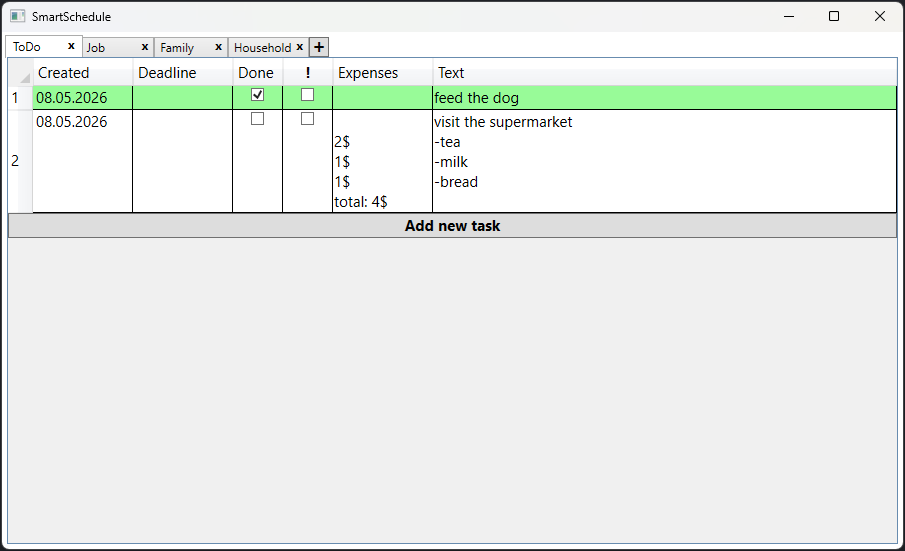
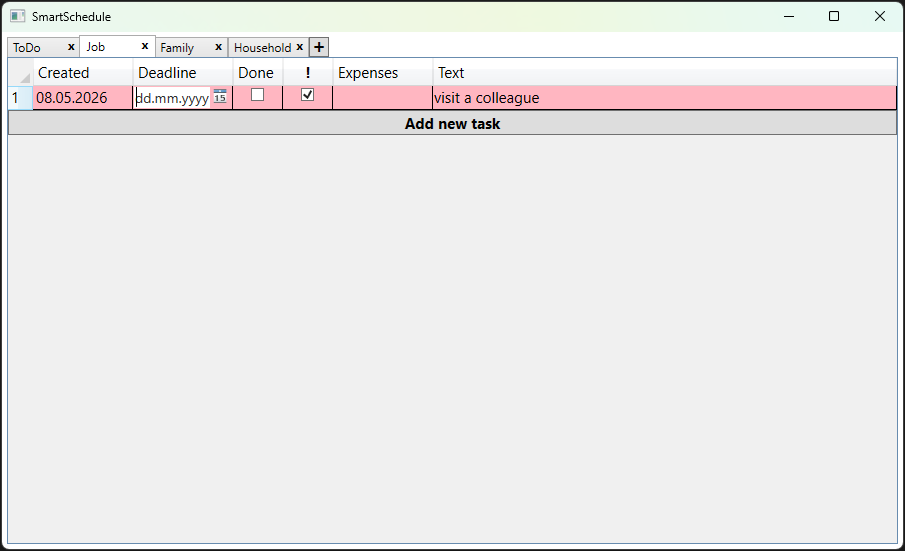
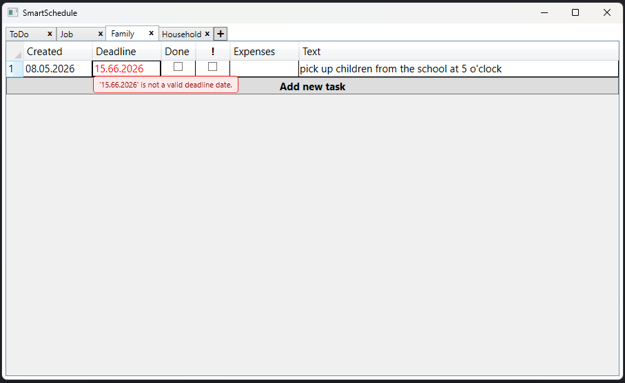

# SmartSchedule (WPF Task Manager)

**SmartSchedule is an intuitive personal task manager built with C# and WPF.** It features a browser-like tab system and smart planning principles to help users stay organized and avoid procrastination.

 

##  Screenshots
1. **Task List / Tab Management**: 
2. **Priority / Deadlines**: 
3. **Custom Date Validation / Masked Input**: 

 

##  Psychological Approach
As a former psychologist, I designed this app using behavioral principles: 
* **Procrastination Prevention**: Specifically designed for medium-term planning where tasks often get delayed.
* **Priority Training**: A strict 30-task limit combined with an 8-tab limit forces users to complete existing tasks before adding new ones, teaching them to focus on what truly matters.

 

##  Key Features
* **Browser-like UX**: Intuitive tab-based interface inspired by modern web browsers.
* **Smart Priority**: Tasks automatically become "Important" (highlighted) if the deadline is within 3 days.
* **Custom Masked DatePicker**: The date format and mask dynamically adapt to the user's region (for example `DD.MM.YYYY` for Russia or `MM/DD/YYYY` for the US).
* **Advanced Validation**: Real-time error tracking with custom animated popups.
* **Easy Sorting**: Organize your tasks by date, priority, or status with one click.
* **Data Protection**: JSON-based logic for automatic saving and loading that prevents any data loss, even after a power outage.

 

##  User Guide

### Tab Management
* `+` Button — Add a new tab (up to 8 tabs max).
* `x` Button — Delete the selected tab (asks for confirmation).
* `Double-Click` on a tab header — Rename the tab.
* `Enter` (while renaming) — Save the new tab name.
* `Escape` or `Ctrl + Z` (while renaming) — Cancel renaming and keep the previous name.

 

##  Tech Stack
* **Programming Language:** C# 13
* **Platform:** .NET 9 / .NET Framework 4.8
* **Framework**: WPF
* **Architecture**: MVVM
* **Validation**: `INotifyDataErrorInfo`
* **User Interface**: XAML (ControlTemplates, MultiDataTriggers, Storyboards), Dynamic `TabControl` with nested `DataGrid` views
* **Data Persistence:** JSON integration with `INotifyPropertyChanged` and `NotifyOnSourceUpdated`

 

##  Installation

**The application has been optimized for Windows by porting the codebase to .NET Framework 4.8.** 

* **System Requirements** : Windows 10 / 11
* **Runs instantly from a single ultra-lightweight 300 KB EXE file.**
* **JSON database is saved locally in AppData\Roaming**

### 3 simple steps to run the app

1. Navigate to the **Releases** section on the top-right side of this page.
2. Download the latest `SmartSchedule.exe` file. 
3. Move it to any folder and double-click to launch!

